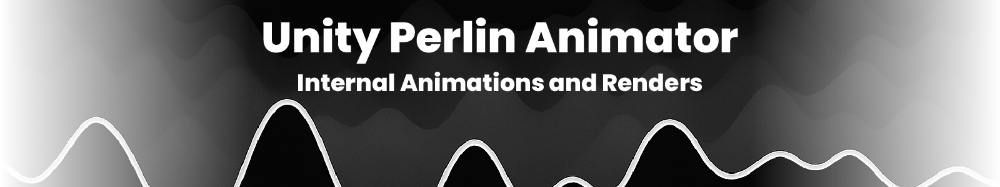

<h1 align="center">
  <a>
    <picture>
      <source height="125" media="(prefers-color-scheme: dark)" srcset="readmetitle.png">
      
    </picture>
  </a>
</h1>

<div align="center">
  <table>
    <tr>
      <td align="center"></td>
      <td align="center"></td>
      <td align="center"></td>
    </tr>
  </table>
</div>

## 🌊 Abstract

This project creates visuals using the animation and rendering capabilities of Unity. Utilizing the Universal Render Pipeline (URP), the project produces high-quality animations that show the versatility of noise functions in creating organic, natural-looking movement and patterns.

Perlin noise, developed by Ken Perlin in 1983, is a gradient noise function that produces a more natural, harmonic appearance compared to simple random functions. This project leverages this characteristic to generate visually appealing animations that can be used for various purposes, including game development, visual effects, and artistic installations.

While these visualizations were left unused in an old product, they are a good example of what can be done with non-interactive environments.

## ⚙️ Installation & Setup

This project requires **Unity 6000 LTS or higher** with the Universal Render Pipeline package installed. Follow these steps to set up the project:

1. **Clone the repository**:
   ```bash
   https://github.com/TheDevAtlas/Noise-Doc-Project
   ```

2. **Open with Unity Hub**:
   - Launch Unity Hub
   - Click "Add" and navigate to the cloned repository folder
   - Select the project folder and open it with the appropriate Unity version

3. **Verify Required Assets**:
   - Universal Render Pipeline package
   - Unity Recorder package

## 🎬 Project Explanation

### Core Components

This project uses scenes to split up the visualizations:

1. **Perlin Plane**: 
   - Generates an NxN grid that is displaced in a wave pattern.
   - Uses Perlin noise to displace the plane.

2. **Minecraft Chunk**:
   - Minecraft chunk generation animation
   - Uses Perlin noise to simulate placement of types of blocks.
   - Animation uses timers and cubic Béziers to interpolate animations.

3. **Generic Animations**:
   - Two separate animations for "voice over" sections.
   - These have visuals of dice rolls, floating numbers, and computer consoles.

## 📚 References and Reading

If you're interested in learning more about Perlin noise and procedural generation techniques used in this project, here are some valuable resources:

- **[Improving Noise](https://mrl.cs.nyu.edu/~perlin/paper445.pdf)** - Ken Perlin's paper on improving noise
- **[The Book of Shaders](https://thebookofshaders.com/11/)** - Excellent guide on noise functions in shaders
- **[Understanding Perlin Noise](https://adrianb.io/2014/08/09/perlinnoise.html)** - A detailed explanation of how Perlin noise works
- **[Procedural Content Generation in Games](https://www.pcgbook.com/)** - Comprehensive book on procedural generation techniques
- **[Unity URP Documentation](https://docs.unity3d.com/Packages/com.unity.render-pipelines.universal@12.0/manual/index.html)** - Official documentation for Universal Render Pipeline
- **[The Nature of Code](https://natureofcode.com/book/chapter-4-particle-systems/)** - Daniel Shiffman's book with excellent chapters on noise and particle systems